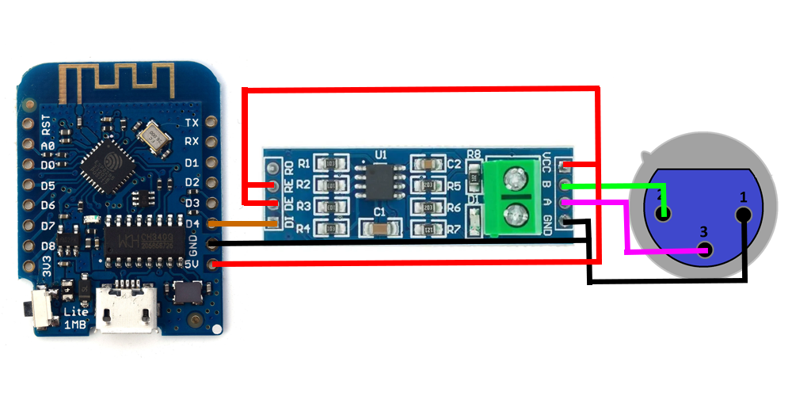
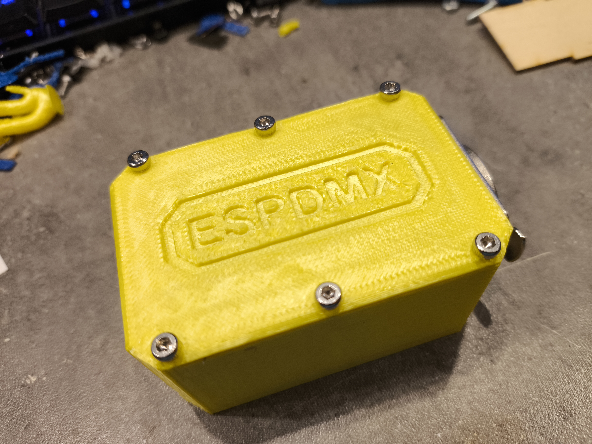

# ESPDMX: Put DMX on WiFi

Hello there!

Welcome to my repo for my first public project! Here, you’ll find everything you need to get your ESPDMX controller up and running.

## What's Included
* ESP8266 Code: Firmware for the ESP8266 to handle DMX over WiFi.
* Python Code: Scripts to send commands to your DMX controller.
* 3D Files: 3D models for your hardware design.
* BOM: Bill of Materials with all the components needed.

## How does it works ?

The ESP creates a WebSocket server, allowing you to send commands (check out the Python code for details). You’ll need to configure your WiFi settings as well. For convenience, the ESP is known on your network as "ESPDMX" by default, but you can change this in the code if you like.

## ROADMAP

Here’s what’s on my to-do list for the MKII version of this project (in order of priority):

- Reduce delays between `ws.send()` and DMX device reaction
- Add security measures like a Token or API Key
- Develop a PCB version
- Implement MQTT compatibility for home automation
- Create a WebApp for configuration (set WiFi SSID and password, choose communication method (WebSocket or MQTT), and direct control without WiFi connection)

## More Details

Here is a schematic of the electronics:

And here is an image of the final product:

